# CHEKET

> ### "투명하게 예매하고, 안전하게 거래하며, 영원히 간직합니다"
> 
> 공연 티켓의 발행부터 정산까지 블록체인에 기록하여 투명성과 신뢰를 높인 NFT 티켓팅 플랫폼
>
- **서비스명**: CHEKET
- **개발 기간**: 2026.03.06 ~ 2026.04.02
- **개발 인원**: 6명 (FE 3, BE 3)

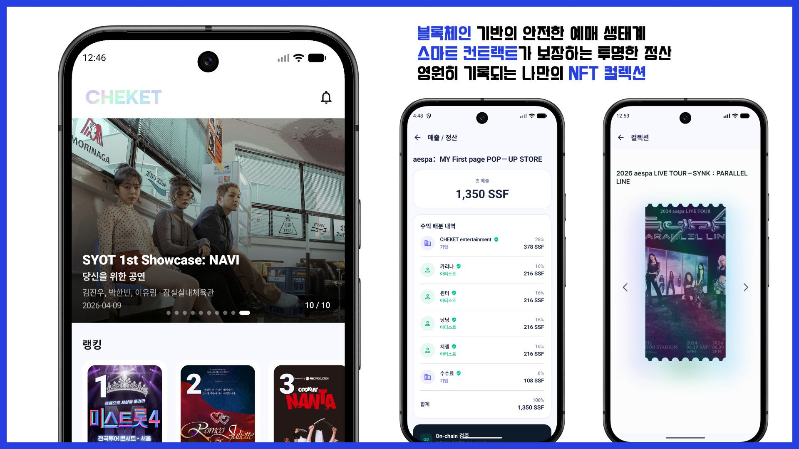

# 목차

- [기획 배경](#기획-배경)
- [주요 화면 및 기능 소개](#주요-화면-및-기능-소개)
- [프로젝트 핵심 기술](#프로젝트-핵심-기술)
- [시스템 아키텍처](#시스템-아키텍처)
- [ERD](#erd)
- [팀원 소개](#팀원-소개)
- [기술 스택](#기술-스택)

# 기획 배경

공연 티켓 시장은 발행, 판매, 정산 등 모든 기록이 플랫폼 내부 서버에만 저장되는 구조로, 아티스트, 관객, 감독기관 등 외부 이해관계자가 이를 독립적으로 검증하기 어렵습니다. 이로 인해 발행 수량의 불투명성, 판매 대금 집중 구조, 정산 과정의 비공개성 등 다양한 문제가 발생할 수 있습니다.

특히 공연 수익이 어떤 기준으로 분배되고 언제 정산되는지 외부에서 확인하기 어려워, 이해관계자는 플랫폼이나 기획사의 내부 관리에 의존할 수밖에 없는 구조입니다.

또한 공식적인 리세일 시장이 부족해 소비자는 비공식 중고거래에 의존하게 되고, 이 과정에서 사기 피해나 과도한 프리미엄 등 시장 왜곡 문제가 발생하고 있습니다.

CHEKET은 블록체인 기반 티켓팅 시스템을 통해 티켓 발행부터 거래, 정산까지의 과정을 투명하게 기록하고 검증 가능하도록 하여 이러한 문제를 해결하고자 합니다.

# 주요 화면 및 기능 소개

## Customer App (일반 관객용 Android)
<table>
  <tr>
    <th>공연 탐색 및 상세</th>
    <th>좌석 선택 및 티켓 구매</th>
  </tr>
  <tr>
    <td valign="top">
      

          
      

      <ul>
        <li>메인 화면에서 AI 추천 공연, 예매수 기준 랭킹, 인기 오픈 예정 공연, 찜한 공연 목록을 조회할 수 있습니다.</li>
        <li>공연 탭에서 지역별 필터링을 할 수 있고, 공연명, 아티스트, 장소로 검색하여 조회할 수 있습니다.</li>
        <li>인기순, 최신순, 마감 임박순, 오픈 임박순으로 정렬할 수 있습니다.</li>
        <li>공연 상세 화면에서는 공연 날짜, 좌석별 가격, 환불 규정 등 공연에 대한 정보를 조회할 수 있습니다.</li>
      </ul>
    </td>
    <td valign="top">
      

        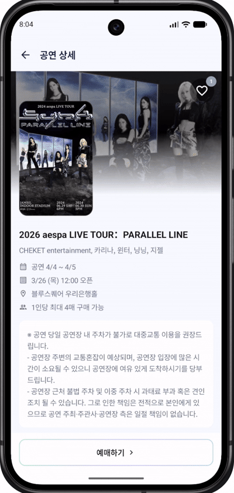  
      

      <ul>
        <li>예매하고 싶은 공연 날짜를 선택한 후 대기열을 기다리고 입장할 수 있습니다.</li>
        <li>입장 후에는 좌석을 선택하고 결제 버튼을 누르면 해당 좌석에 락이 걸립니다.</li>
        <li>결제하기를 누르면 보유한 SSF 코인으로 결제가 진행되며, 블록체인 네트워크에 소유권이 기록됩니다.</li>
      </ul>
    </td>
  </tr>
</table>

<table>
  <tr>
    <th>내 티켓</th>
    <th>QR 코드</th>
  </tr>
  <tr>
    <td valign="top">
      

        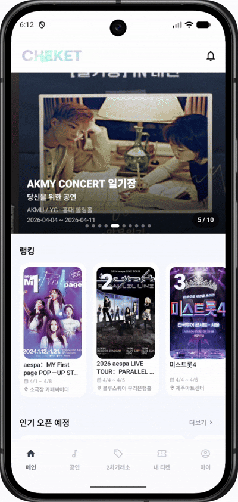  
      

      <ul>
        <li>내 티켓 탭에서 가지고 있는 티켓 목록을 조회할 수 있습니다.</li>
        <li>2차 거래소에 등록해 판매 중인 티켓과 보유 중인 티켓을 필터링해 조회할 수 있습니다.</li>
      </ul>
    </td>
    <td valign="top">
      

        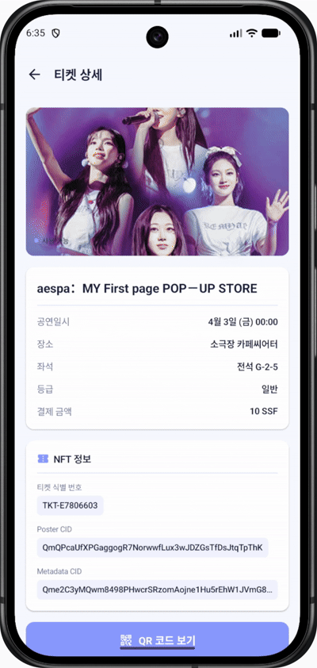  
      

      <ul>
        <li>동적 QR 코드를 받아올 수 있습니다.</li>
        <li>주최측이 스캐너 앱을 통해 QR을 스캔하여 좌석 정보를 확인할 수 있도록 합니다.</li>
      </ul>
    </td>
  </tr>
</table>

<table>
  <tr>
    <th>2차 거래소</th>
    <th>지정 양도</th>
  </tr>
  <tr>
    <td valign="top">
      

          
      

      <ul>
        <li>2차 거래소에서 정가보다 저렴하게 올라와 있는 티켓을 구매할 수 있습니다.</li>
      </ul>
    </td>
    <td valign="top">
      

        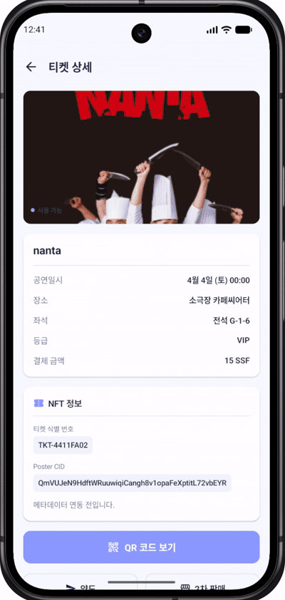  
      

      <ul>
        <li>전화번호를 이용해 양도 대상을 검색하고 티켓을 양도할 수 있습니다.</li>
      </ul>
    </td>
  </tr>
</table>

<table>
  <tr>
    <th>알림/승인</th>
    <th>계약서</th>
  </tr>
  <tr>
    <td valign="top">
      

        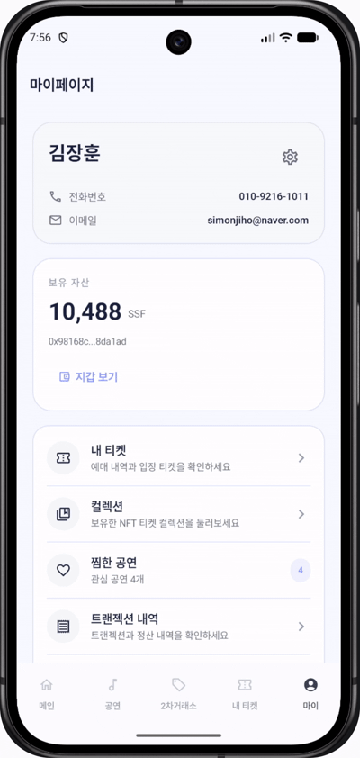  
      

      <ul>
        <li>다음과 같은 사항들에 대한 알림을 받아볼 수 있습니다.</li>
        <li>공연 등록/수정 승인 요청 알림 클릭 시 해당 공연의 수익 분배 비율과 계약 내용을 확인하고 승인 또는 거절할 수 있습니다.</li>
        <li>예매한 티켓에 대한 공연 시작 알림을 받을 수 있습니다.</li>
        <li>2차 거래소에 올린 티켓의 판매 완료 알림을 받을 수 있습니다.</li>
      </ul>
    </td>
    <td valign="top">
      

        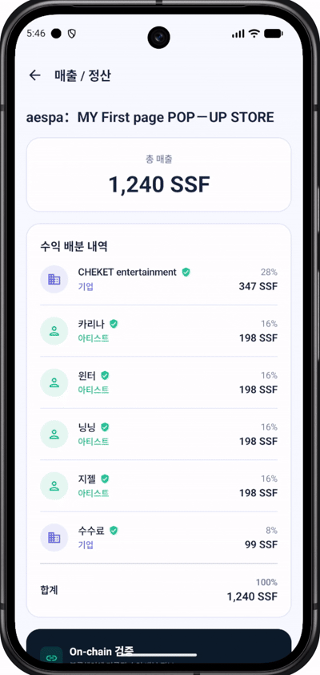  
      

      <ul>
        <li>공연 등록 시 이해관계자별 수익 분배 비율과 계약 내용을 확인할 수 있습니다.</li>
      </ul>
    </td>
  </tr>
</table>

## Host Web (주최측용 웹)

### 공연 등록

- 주최측은 공연명, 일정, 장소, 포스터, 좌석 배치도, 예매 기간 등 공연에 필요한 정보를 입력하여 공연을 등록할 수 있습니다.
- 공연 등록 과정에서 좌석 등급별 가격과 1인당 구매 가능 수량, 리세일 가격 상한 등의 예매 규칙을 함께 설정할 수 있습니다.
- 이해관계자를 등록하고 수익 분배 비율을 설정하여 정산 기준을 사전에 확정할 수 있습니다.
- 등록이 완료되면 공연 정보와 예매 규칙, 수익 분배 기준이 반영되어 이후 예매와 정산의 기준 데이터로 활용됩니다.

### 판매 대시보드

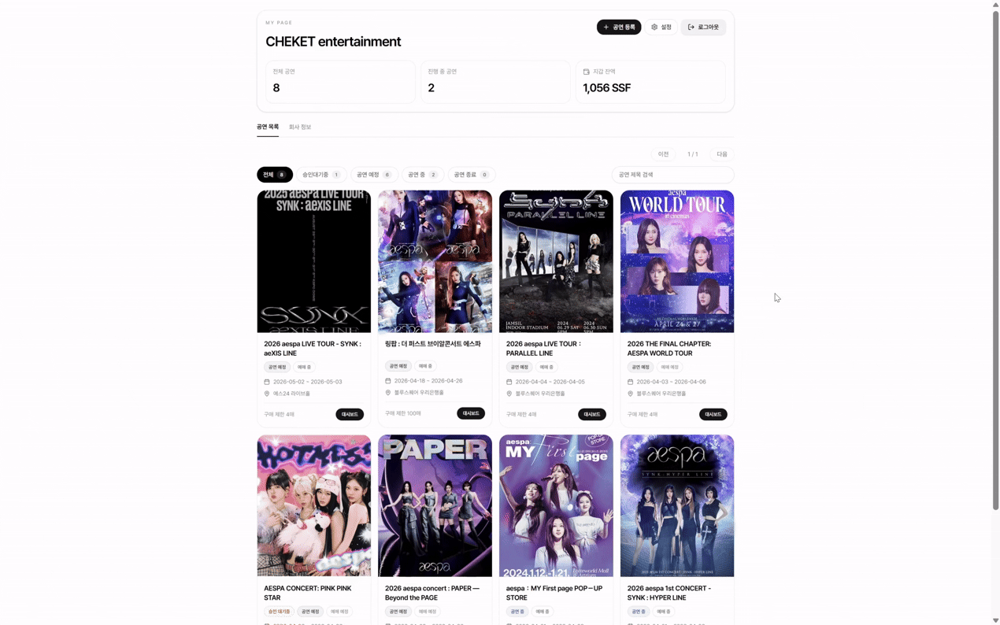

- 주최측은 대시보드에서 공연별 판매 현황과 전체 예매율을 한눈에 확인할 수 있습니다.
- 회차별 예매 좌석 수와 잔여 좌석 수를 확인할 수 있어 공연 운영 상황을 실시간으로 파악할 수 있습니다.
- 판매 대금과 정산 내역도 함께 확인할 수 있어 공연 수익 흐름을 투명하게 관리할 수 있습니다.

## Customer Collection (NFT 보관함 웹)

### 티켓 컬렉션

    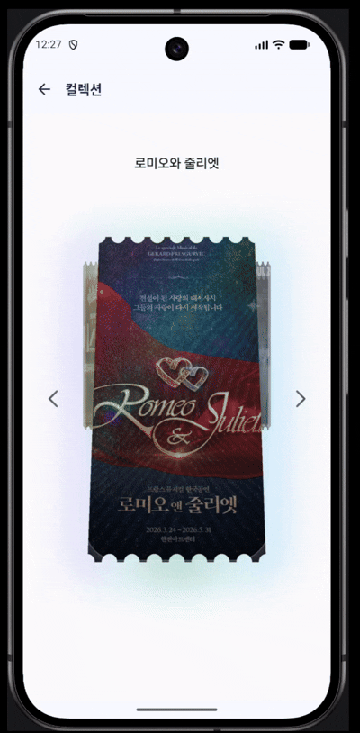  

- 공연이 종료된 후에도 사용한 티켓은 사라지지 않고 NFT 형태로 보관함에 저장됩니다.
- 보관함에서는 공연 포스터, 관람 날짜, 좌석 정보가 담긴 티켓을 갤러리 형태로 확인할 수 있습니다.
- 사용자는 관람한 공연 티켓을 디지털 컬렉션처럼 모아보고 소장할 수 있습니다.

## Scanner App (입장 스태프용 Android)

    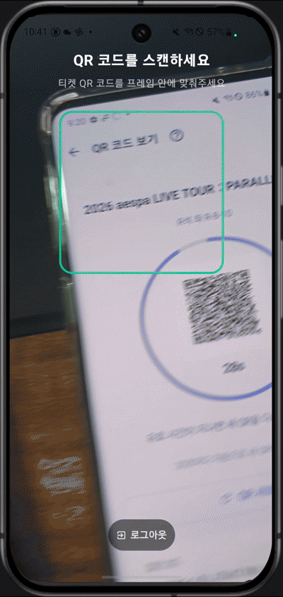  

- 동적 QR을 스캔하여 티켓을 검증하고, 검증 통과 시 티켓에 대한 메타데이터(공연, 회차, 좌석 정보)를 띄웁니다.

# 프로젝트 핵심 기술

## 7-Contract 스마트 컨트랙트 아키텍처

3-Layer Composable NFT와 4개의 거래·정산 컨트랙트로 구성됩니다.

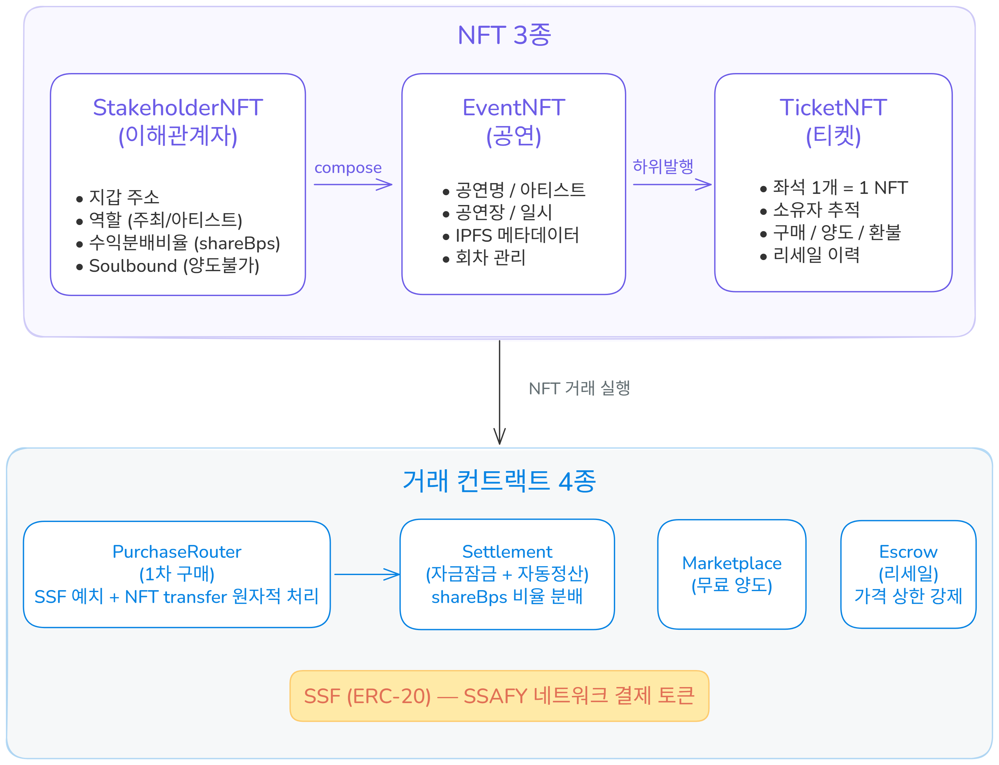

## Custodial 지갑 아키텍처

사용자는 블록체인을 모르는 일반 관객입니다. 기존 티켓팅 앱과 동일한 UX를 유지하면서 블록체인의 투명성을 제공합니다.

| 항목 | 구현 |
| --- | --- |
| 지갑 생성 | 회원가입 시 서버가 Keystore V3 지갑 자동 생성 + 암호화 보관 |
| 로그인 | 이메일/비밀번호 (지갑 존재를 모름) |
| TX 서명 | 서버가 대리 서명 (사용자 개입 없음) |
| 가스비 | 서버 대납 (gasPrice = 0, SSAFY 네트워크) |
| 초기 SSF | 가입 시 플랫폼 지갑에서 초기 SSF를 사용자에게 제공하여 테스트 |
| approve | 서버가 PurchaseRouter·Escrow에 대한 approve 사전 설정 |

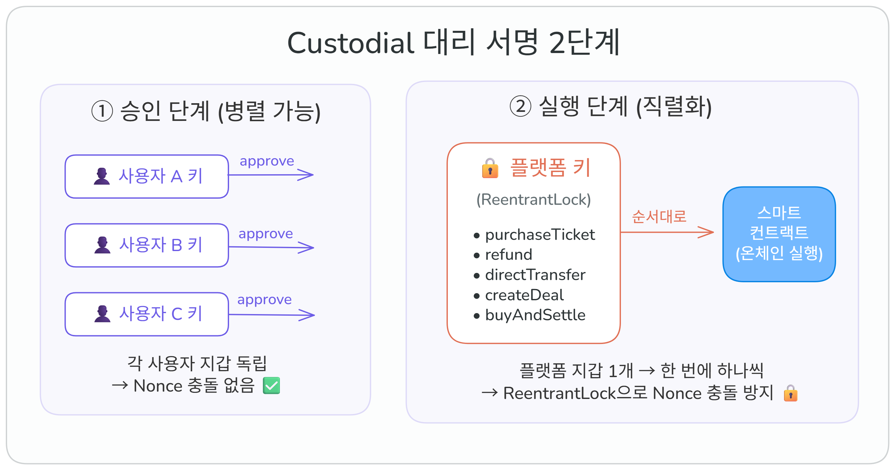

## 대기열 시스템

티켓팅 오픈 시 동시 접속 폭주에 대응합니다.

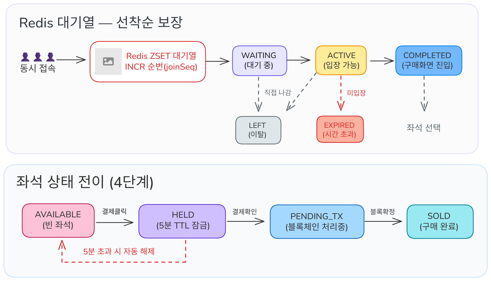

사용자가 처음 공연 페이지에 들어오면 바로 좌석 선택으로 가는 것이 아니라 먼저 대기열에 입장합니다.
이때 시스템은 대기열 입장 토큰을 만들고, 현재 순서와 상태를 함께 관리합니다. 사용자는 안내된 주기마다 자신의 순서를 확인하면서 기다리게 됩니다.

순서가 아직 오지 않았다면 대기 상태를 유지하고, 순서가 되면 좌석 선택으로 넘어갈 수 있는 상태로 바뀝니다.
그다음 사용자가 좌석 선택 페이지로 이동을 요청하면 시스템이 마지막으로 상태를 확인한 뒤 좌석 선택 권한을 발급하고, 사용자는 실제 좌석 선택 화면으로 진입합니다.

이 과정의 핵심은 공정성과 안정성입니다.
먼저 들어온 사용자가 먼저 기회를 받고, 동시에 너무 많은 사람이 구매 단계로 진입하지 않도록 흐름을 나누기 때문에 서비스가 갑자기 느려지거나 멈추는 상황을 줄일 수 있습니다.

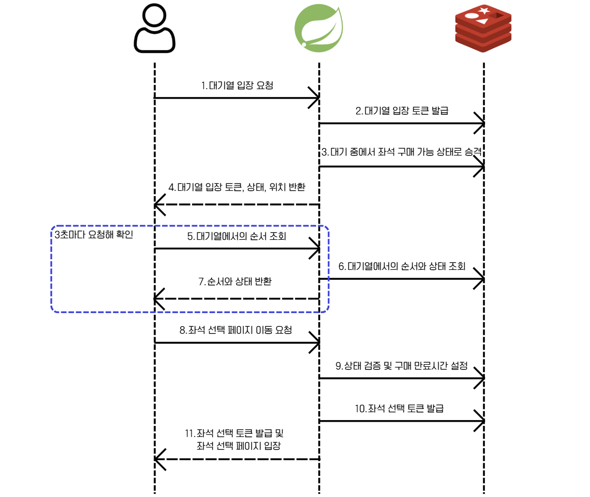

## 비동기 TX 파이프라인

블록체인 TX 확정을 기다리지 않고 즉시 응답을 반환합니다. 사용자는 폴링으로 블록 처리 과정(PENDING → SUBMITTED → CONFIRMED)을 실시간으로 확인합니다.

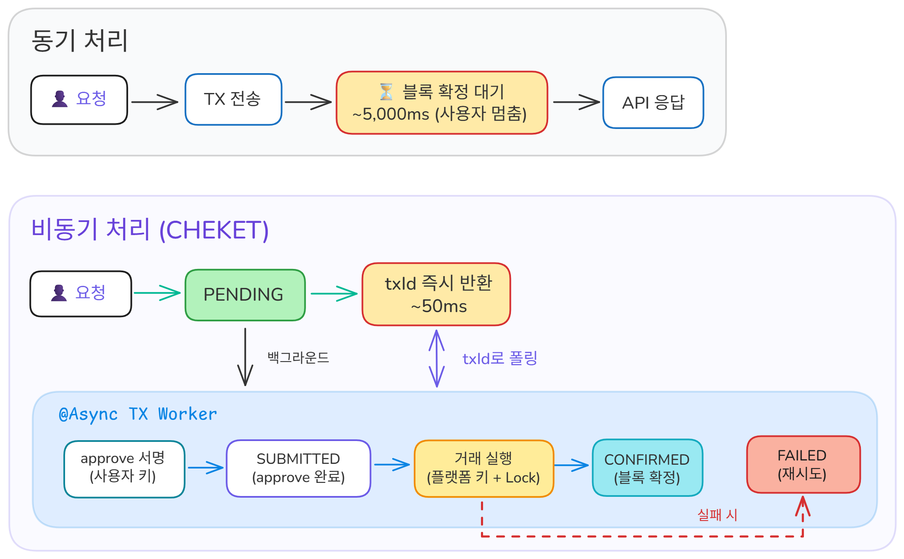

## 컨트랙트 강제 규칙

서버 로직이 아닌 스마트 컨트랙트 코드로 규칙을 강제하여 우회를 불가능하게 합니다.

| 규칙 | 컨트랙트 | 메커니즘 |
| --- | --- | --- |
| 구매 수량 제한 | EventNFT | `maxPerWallet` + `walletTicketCount` 온체인 검증 |
| 리세일 가격 상한 | Escrow | `TicketNFT.getPrice()` × `resaleCapBps` on-chain 검증 |
| 분배 비율 고정 | StakeholderNFT | Soulbound — 발행 후 변경·양도 불가 |
| 자금 횡령 방지 | Settlement | 판매 즉시 컨트랙트 잠금, `finalizeSession()`만 분배 가능 |
| 거래 원자성 | PurchaseRouter / Escrow | 1 TX 처리, 부분 실패 시 전체 revert |

## 온체인 / 오프체인 데이터 분리

신뢰가 필요한 데이터는 온체인에, 용량이 큰 파일은 IPFS에, UX·성능 데이터는 서버 DB에 저장하여 가스비와 성능을 최적화했습니다.

| 온체인 (불변·공개) | IPFS (분산·영구) | 오프체인 서버 DB |
| --- | --- | --- |
| 티켓 소유권·거래 이력 | 공연 포스터 이미지 | 사용자 프로필 |
| 발행 수량 (totalSupply) | 티켓 디자인 이미지 | 공연 검색·필터·정렬 |
| 이해관계자 분배 비율 (shareBps) | 메타데이터 JSON | 좌석 배치도 레이아웃 |
| 판매 대금 예치 (Settlement) |  | 대기열·좌석 Lock |
| 구매 제한·리세일 상한 |  | maxPerWallet · resaleCapBps |
| 체크인 기록 |  | 알림·Push 설정 |

## Android Host + Remote Renderer WebView 아키텍처

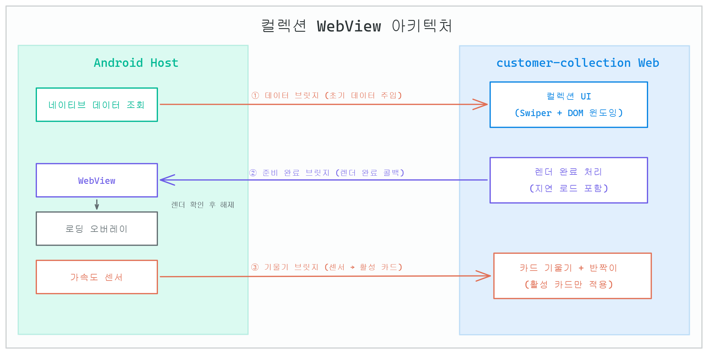

| **구성** | **역할** |
| --- | --- |
| **데이터 브릿지** | Android가 미리 조회한 컬렉션 데이터를 JSON으로 웹에 주입. 웹은 별도 API 호출 없이 바로 렌더링 |
| **준비 완료 브릿지** | 웹의 렌더가 실제로 끝난 시점을 Android에 알림. Android는 이 콜백 + 시각 콜백을 모두 확인한 뒤 오버레이 해제 |
| **기울기 브릿지** | 가속도 센서 값을 웹에 전달. 현재 보이는 카드에만 적용해 불필요한 연산 차단 |

로딩 흐름
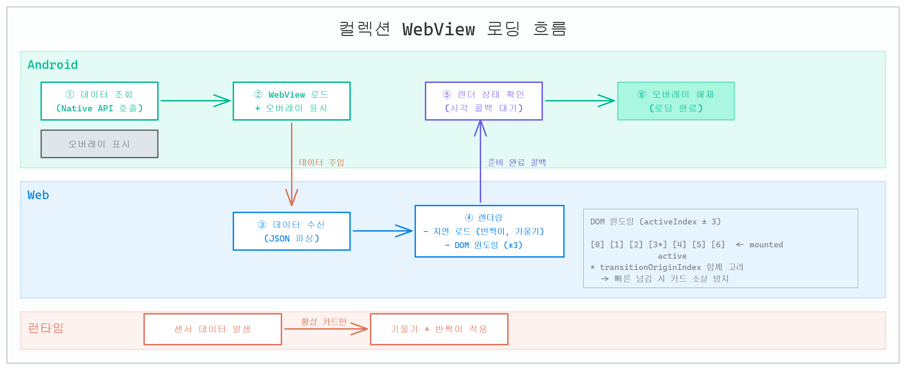

1. Android가 Native API로 데이터를 먼저 조회
2. WebView 로드와 동시에 로딩 오버레이 표시
3. 로드 완료 후 데이터 브릿지로 JSON 주입
4. 웹에서 컬렉션 렌더링 (반짝이·기울기 효과는 지연 로드)
5. 웹이 준비 완료 콜백 → Android가 시각 콜백으로 실제 렌더 확인
6. 오버레이 해제

# 시스템 아키텍처

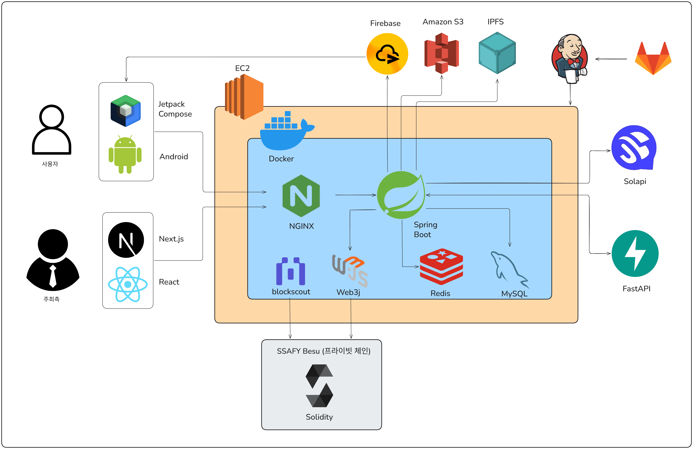

# ERD

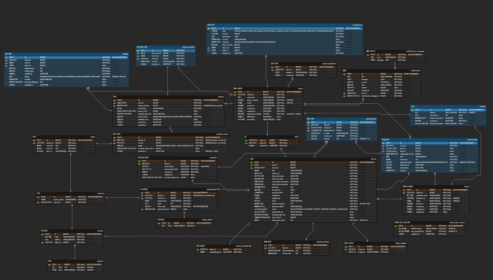

# 팀원 소개

<table>
  <tr>
    <td align="center">
      
    </td>
    <td align="center">
      
    </td>
    <td align="center">
      
    </td>
  </tr>
  <tr>
    <td align="center">
       
      <a href="https://github.com/beginner3579">김건호</a>
    </td>
    <td align="center">
       
      <a href="https://github.com/simonjiho">김지호</a>
    </td>
    <td align="center">
       
      <a href="https://github.com/gangyoung0">조강영</a>
    </td>
  </tr>

  <tr>
    <td align="center">
      
    </td>
    <td align="center">
      
    </td>
    <td align="center">
      
    </td>
  </tr>
  <tr>
    <td align="center">
       
      <a href="https://github.com/sondahyun">손다현</a>
    </td>
    <td align="center">
       
      <a href="https://github.com/JinwonYun">윤진원</a>
    </td>
    <td align="center">
       
      <a href="https://github.com/hjoo830">황효주</a>
    </td>
  </tr>
</table>

 

# 기술 스택

## Frontend

  
  
  

  
  
  

## Backend

  
  
  
  
  

## Blockchain

  
  
  

## AI

  
  

## Infra

  
  
  
  
  
  
  

